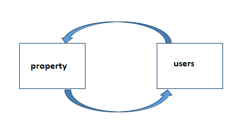
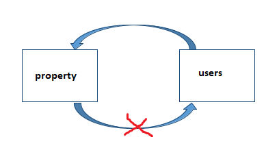

# Real Estate Application (made with django, postgres SQL)

## Why Circular dependency error has appeared?
 
- Both users and property apps have dependencies and both apps are connected with each other with foreign keys.
- So when we want to migrate the database then both apps can't migrate at the same time and also can't migrate separately.

## How can i solve the problem?
 
- First we need to cut the connection between these two apps.
- So comment out the `property` section the `wishlist class` from the `users` app's `models.py`.
- also, comment out `wishlist` from `Profile class`.
- makemigrations the `users` app and then migrate
- makemigrations the `property` app and then migrate
- uncomment the commented lines
- makemigrations the rest of the apps and then migrate.